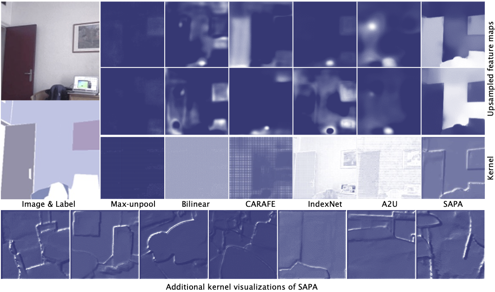
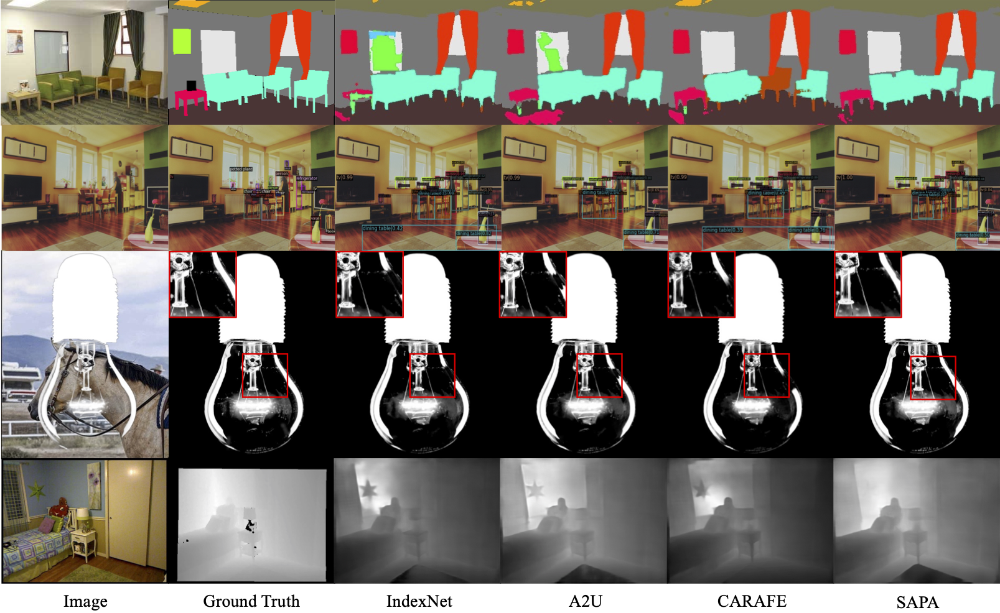

# SAPA: Similarity-Aware Point Affiliation for Feature Upsampling

<p align="center"></p>

This repository includes the official implementation of SAPA, a universal feature upsampling operator, presented in our paper:

**[SAPA: Similarity-Aware Point Affiliation for Feature Upsampling](https://arxiv.org/abs/2209.12866)**

Proc. Annual Conference on Neural Information Processing Systems (NeurIPS 2022) **Spotlight**

[Hao Lu](https://sites.google.com/site/poppinace/), Wenze Liu, Zixuan Ye, Hongtao Fu, Yuliang Liu, Zhiguo Cao

Huazhong University of Science and Technology, China

## Updates
- 17 July 2023: The code of the extended version [On Point Affiliation in Feature Upsampling](https://arxiv.org/abs/2307.08198) is available [here](https://github.com/tiny-smart/sapa).
- 11 Nov 2022: Our paper is picked as **Spotlight** presentation (5%)!
- 27 Sep 2022: Code is released, and camera ready is avaliable on [arXiv](https://arxiv.org/abs/2209.12866)!

## Highlights
- **Simple and effective:** SAPA defines a novel class of similarity-aware upsampling kernels, which can simultaenously encourage semantic smoothness and boundrary sharpness;
- **Generic:** SAPA can benefit a number of dense prediction tasks. In our paper, we validate semantic segmentation, object detection, depth estimation, and image matting;
- **Plug-and-play:** SAPA is applicable to any encoder-decoder architectures or feature pyramid networks;
- **Lightweight:** SAPA only introduces negligible extra computational overhead and number of parameters.
- **Memory-efficient:** We have provided a CUDA implementation to reduce memory cost and to improve efficiency.

<p align="center"></p>

## Installation
Our codes are tested on Python 3.8.8 and PyTorch 1.9.0.
```shell
cd sapa
python setup.py develop
```

## Reported Results

Here is a summary of our reported results on different dense prediction tasks:
#### Semantic Segmentation on ADE20K

| Segformer B1  | mIoU  | FLOPs     | Params    | MaskFormer SwinBase   | mIoU  | FLOPs  | Params   | Mask2Former SwinBase   | mIoU  | FLOPs  | Params   |
| :--:          | :--:  | :--:      | :--:      | :--:                  | :--:  | :--:   | :--:     | :--:                  | :--:  | :--:   | :--:     | 
| Nearest        | --    | --        | --        | Nearest                | 52.70 | 195    | 102      | Nearest        | --    | --        | --        | 
| Bilinear      | 41.68 | 15.91     | 13.74     | Bilinear              | --    | --     | --       | Bilinear      | 53.90 | 223     | 107     | 
| CARAFE        | 42.82 | +1.45     | +0.44     | CARAFE                | *53.53* | +0.84  | +0.22  | CARAFE        | 53.94 | +0.63     | +0.07     | 
| IndexNet      | 41.50 | +30.65    | +12.60    | IndexNet              | 52.92 | +17.64 | +6.30    | IndexNet      | 54.71 | +13.44    | +2.10    | 
| A2U           | 41.45 | +0.41     | +0.06     | A2U                   | 52.73 | +0.23  | +0.03    | A2U           | 54.40 | +0.18     | +0.01     | 
| SAPA-I        | 43.05 | +0.75     | +0.00     | SAPA-I                | 53.25 | +0.43  | +0.00    | SAPA-I                | *55.05* | +0.33  | +0.00    |
| SAPA-B        | *43.20* | +1.02   | +0.1      | SAPA-B                | 53.15 | +0.59  | +0.05    | SAPA-B                | 54.98 | +0.45  | +0.02    |
| SAPA-G        | **44.39** | +1.02 | +0.1      | SAPA-G                | **53.78** | +0.59 | +0.05 | SAPA-G                | **55.22** | +0.45 | +0.02 |

-**Notes:** i) For SegFormer, we use their official [code](https://github.com/NVlabs/SegFormer) rather than the version in [mmsegmentation](https://github.com/open-mmlab/mmsegmentation), and conduct experiments on a **single** A6000 GPU. ii) We observe that MaskFormer and Mask2Former are somewhat unstable. Due to limited resources, we only report one-run results. 

#### Image Matting on Adode Composition-1K
| A2U Matting (R34) | Params  | SAD  | MSE | Grad | Conn |
| :---:        | :---:    | :---: | :---:| :---: | :---: |
Nearest | 8.05 | 37.51 | 0.0096 | 19.07 | 35.72 |
Bilinear | 8.05 | 37.31 | 0.0103 | 21.38 | 35.39 |
CARAFE | +0.26 | 41.01 | 0.0118 | 21.39 | 39.01 |
IndexNet | +12.26 | 34.28 | 0.0081 | 15.94 | 31.91 |
A2U | +0.02 | 32.15 | 0.0082 | 16.39 | 29.25 |
SAPA-I | +0 | 34.25 | 0.0091 | 18.93 | 32.09 |
SAPA-B | +0.04 | 31.19 | 0.0079 | **15.48** | 28.30 |
SAPA-G | +0.04 | **30.98** | **0.0077** | 15.59 | **27.96** |

#### Depth Estimation on NYU Depth V2
BTS (R50) | Params | $\delta < 1.25$ | $\delta < 1.25^2$ | $\delta < 1.25^3$ | Abs Rel | Sq Rel | RMS | RMSlog | log10 |
| :---: |  :---:   | :---: | :---: | :---: | :---: | :---: | :---: | :---:   | :---: |
Nearest | 49.53 | 0.865 | 0.975 | 0.993 | 0.119 | 0.075 | 0.419 | 0.152 | 0.051 |
CARAFE | +0.41 | 0.864 | 0.974 | 0.994 | 0.117 | 0.071 | 0.418 | 0.152 | 0.051 |
IndexNet | +44.20 | 0.866 | 0.976 | **0.995** | 0.117 | 0.071 | 0.416 | 0.151 | 0.050 |
A2U | +0.08 | 0.860 | 0.973 | 0.993 | 0.121 | 0.077 | 0.429 | 0.156 | 0.052 |
SAPA-B | +0.16 | 0.871 | 0.977 | 0.994 | **0.116** | 0.070 | 0.410 | 0.151 | 0.050 |
SAPA-G | +0.25 | **0.872** | **0.978** | **0.995** | **0.116** | **0.069** | **0.408** | **0.149** | **0.049** |

#### Object Detection on MS COCO

Faster R-CNN (R50) | Params | $AP$ | $AP_{50}$ | $AP_{75}$ | $AP_S$ | $AP_M$ | $AP_{L}$ |
| :---: |  :---:   | :---: | :---: | :---: | :---: | :---: | :---: | 
Nearest  | 41.53 | 37.4 | 58.1 | 40.4 | 21.2 | 41.0 | 48.1 |
CARAFE   | +0.22 | **38.6** | **59.9** | **42.2** | **23.3** | **42.2** | **49.7** |
IndexNet | +6.30 | 37.6 | 58.4 | *40.9* | 21.5 | 41.3 | *49.2* |
A2U      | +0.03 | 37.3 | 58.7 | 40.0 | 21.7 | 41.1 | 48.5 |
SAPA-I   | +0 | 37.7 | *59.2* | 40.6 | 22.2 | 41.2 | 48.4 |
SAPA-B   | +0.05 | *37.8* | *59.2* | 40.6 | *22.4* | *41.4* | 49.1 |
SAPA-G   | +0.05 | *37.8* | 59.1 | 40.8 | 21.5 | *41.4* | 48.6 |


## Citation
If you find this work or code useful for your research, please cite:
```
@inproceedings{lu2022sapa,
  title={SAPA: Similarity-Aware Point Affiliation for Feature Upsampling},
  author={Lu, Hao and Liu, Wenze and Ye, Zixuan and Fu, Hongtao and Liu, Yuliang and Cao, Zhiguo},
  booktitle={Proc. Annual Conference on Neural Information Processing Systems (NeurIPS)},
  year={2022}
}
```

## Permission
This code is for academic purposes only. Contact: Hao Lu (hlu@hust.edu.cn)
